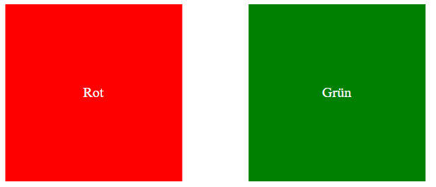
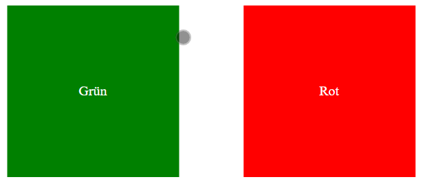

# HTML DOM - Farbwechsel (3)

Vertausche die Farben und den Text der div-Container mit JavaScript, ohne die HTML und CSS Datei zu verändern.

## Ausgangssituation

## Ziel

## Schritte

* Laden der Elemente
* Ändern der Hintergrundfarben und Texte
* **Zusatzaufgabe:** Lasse die Farben und Texte in einem Interval von 2 Sekunden wechseln. Hinweis: *classList.toggle()*