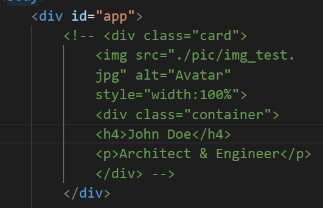

# Erstellen einer Mitarbeiterliste
## Schwierigkeit: Mittel bis Schwer (Zusatzaufgabe)
### Voraussetzungen:
 - Iteration von *arrays*
 - Zugriff *properties* von *objects*
 - Funktionen schreiben, Funktionsparameter (kwargs,args)
 - *DOM* Manipulatoren
 - *HTML und CSS* Grundlagen
 - *async await*

### Lernziele:
 - notwendige Daten aus einer API nutzen, um damit das Front-End zu ändern
 - Abstraktion von Funktionen

Im Regelfall hat man Daten in einer Datenbank und macht sie mittels einer *API* zugänglich. Wir wollen eine sogenannte *Test-API* nutzen um diesen Vorgang zu üben. [randomuser-API](https://randomuser.me/) ist eine einfach nutzbare *API*. 

1. Wir möchten die *API* dieser Seite so nutzen, dass uns Daten zu **15 NutzerInnen** ausgegeben werden. Erkunde die Seite und finde heraus welche *Routen* und *Parameter* du zum *Endpoint* ergänzen musst. Lasse dir das Ergebnis im Browser und in Postman ausgeben.

2. Bevor man in *javaScript* die notwendigen Elemente mit den *Attributen* erzeugt, macht es Sinn das **Front-End** in *html* und *CSS* zu testen. Für eine Karte kann folgende 

   

  verwendet werden. Style den **app**-Container (in diesem kommen die Karten rein) und entsprechend weitere **Tags und class**, sodass du eine nette Karte hast. Falls   das *styling* dir zu lange dauert, nehme die beiliegende *CSS* als Vorlage.

3. Nun kommentiere den *html* Code aus. Du solltest nun eine Funktion schreiben, welche eine Karte mit den entsprechenden Tags und *Attributen* (*class*,*src*...) erstellt. Benutze erstmal eine *List* mit 15 eigens getippten Namen über welche iteriert werden soll, damit den Karten jeweils der Name hinzugefügt werden soll. Die Email kann erstmal für alle Karten weiterhin ein Platzhalter bleiben. Die Schleife kann in der Funktion später (in 6.) genutzt werden oder auch wieder entfernt werden, da man außerhalb der Funktion eine Schleife, welche über die notwendigen Daten iteriert und diese als Funktionsargumente übergibt, setzen kann.

4. (Zusatz! Kann auch erst am Ende gemacht werden!) Ich fand es aufwendig für jedes Childelement immer wieder mittels der *dot - Notation* die *Attribute* zu vergeben. Ich dachte man könne doch eine Funktion schreiben, die ein *html-Element* annimmt als erstes Argument und mehrere Argument in Listenform *[Attribut,Wert]* z.B ["src","irgendeine/url]" entgegennimmt. Diese Funktion verarbeitet mittels *if-else* oder *switch-case* (nachschauen) die Argumente.

5. Du solltest jetzt eine Funktion zur Erstellung einer Karte für ein *array* haben. Nun wollen wir erstmal die *API* erkunden. Schreibe dafür eine *async await* Funktion und lasse dir die Daten ausgeben! Siehst du das *array* von *objects*? Versuche auf den Namen aller Objekte, die Email und die Bildadresse zuzugreifen und diese auszugeben.

6. Nun überlege dir wie du die notwendigen Daten aus dem *array aus objects* mit deiner Funktion verarbeiten kannst. Falls du eine Schleife zur Iteration einer Liste in deiner Funktion bereits implementiert hast, übergibst du natürlich das *array aus objects* komplett deiner Funktion und musst deine Funktion (in ihrer Definition) daraufhin anpassen, dass auf den richtigen Wert in den *objects* zugegriffen wird. Ansonsten kannst du auch eine Schleife außerhalb der Funktion nutzen. Diese iteriert über alle *objects* in dem *array*. Du könntest nun auf die einzelnen Werte (*Name*,*Email*,*Bildadresse*) eines *objects* zugreifen und diese in die Funktion als Argumente übergeben.

