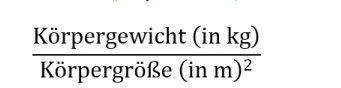

# BMI Messer
Eine Funktion zum Berechnen des BMI

## Aufgaben

* Schreibe eine Funktion, die den BMI berechnet. Dem Bild könnt ihr die Formel entnehmen.   

* Definiere zunächste die Funktion mit einem passenden Namen. Übergebe der Funktion die Parameter **weight** und **height**.

* Speichere innerhalb der Funktion die Berechnung in der Variablen **bmi**.

* Zuletzt soll der Wert der Variablen zurückgegeben werden. Achte vorher jedoch darauf, dass der Wert ohne Nachkommastellen gerundet wird. Schaue im Internet welche Möglichkeiten das **Math** Modul hierfür bietet.

* Nun solltest du außerhalb der Funktion mit Hilfe von **console.log()** den BMI ausgeben können. Rufe die Funktion mit zwei frei gewählten Werten für die Parameter **weight** und **height** innerhalb von **console.log** auf.

* Mit den Werten 75 für **weight** und 1.8 für **height** solltest du 23 als BMI rausbekommen.