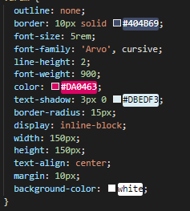
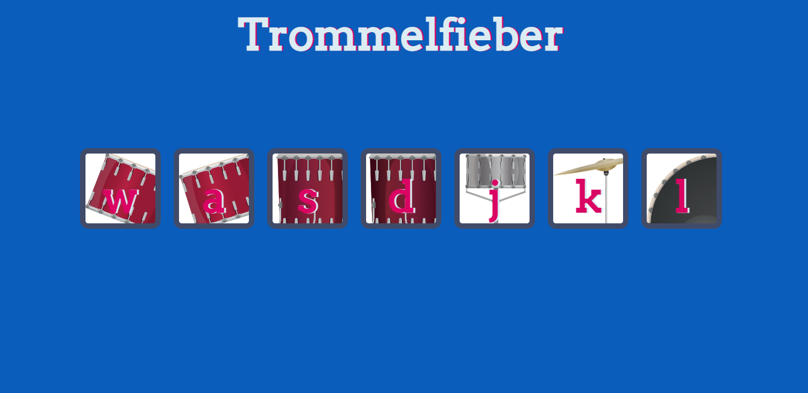
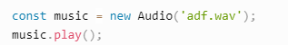

# Trommelfieber
Spiele einzelene Sounds eines Schlagzeugs ab um dein eigener Musiker zu werden. Nutze DOM Manipulation um auf einzelne Elemente zuzugreifen.

## Aufgaben

* Erstelle eine HTML-Datei mit einem HTML-Grundgerüst (Engl: "Boilerplate-Code") sowie eine neue CSS-Datei. Verlinke nun die CSS-Datei im Header der HTML-Datei. Zusätzlich soll eine Google Schriftart (Google Fonts) eingebunden werden.
```css
<link href="https://fonts.googleapis.com/css2?family=Arvo" rel="stylesheet">
<link href="style.css" rel="stylesheet">
```

* Füge eine Überschrift mit einer id deiner Wahl (z.B *title*) in deine HTML-Datei.

* Erstelle ein *div*-Element mit einer Klasse (z.B. *trommel*). In diesem *div* sollen Buttons für sieben Knöpfe erstellt werden, die du später drücken kannst um einen Sound zu erzeugen. In jedem Button steht ein anderer Buchstabe, der im späteren Verlauf über die Tastatur angesteuert werden kann.  
Füge jedem Button zusätzlich die Klasse **drum** hinzu.
```html
<div>
  <button class="w">w</button>
  <button class="a">a</button>
  <button class="s">s</button>
  <button class="d">d</button>
  <button class="j">j</button>
  <button class="k">k</button>
  <button class="l">l</button>
</div>
```

* Erstelle eine JavaScript Datei und füge sie an der richtigen Stelle im HTML-Dokument hinzu (*src*).

* Folgende CSS Styles sollen konfiguriert werden:
    - Der Text soll zentriert sein.
    - Ändere die Hintergrundfarbe.
    - Style deine Überschrift nach Wahl.
    - Gehe nun auf die Klassen für deine Buttons ein und füge jeweils ein passendes Bild hinzu. Tipp: Suche nach der Eigenschaft **background-image**. Im Ordner images findest du die passenden Bilder.
    - Das *div* in dem sich die Buttons befinden, soll folgende Eigenschaft haben: **margin: 10% auto**.
    - Nun style das Umfeld der einzelnen Buttons. Wähle die zugehörige Klasse (*drum*) und füge die Eigenschaften des folgenden Bildes der CSS-Datei hinzu.



 

* Nun sollte deine Seite ähnlich dem oberen Bild aussehen.

* Füge eine Klasse **pressed** in die CSS Datei ein. Wir werden diese Klasse später in unserem JavaScript-Code brauchen. Die Eigenschaft **box-shadow** soll folgende Werte erhalten: **0 3px 4px #DBEDF3**,außerdem **opacity: 0.5**.

* Gehe nun in deine JavaScript Datei und erledige folgende Aufgaben:
   * Erstelle eine Funktion **mache_sound** oder **make_sound** mit dem Parameter **key**. Greife innerhalb der Funktion auf den Parameter mit einen **switch-statement** zu (alternativ **if-else**). Für jeden Button soll eine passende Audio-Datei abgespielt werden. Hierfür soll der übergeben *key* (w, a, s, d, j, k, oder l) überprüft werden. Im folgenden Bild wird sichtbar wie man eine Audio Variable erstellt und diese abspielt. Als **default** bzw. **else** soll in der console der **Key** ausgegeben werden.   
    
   * Nun wollen wir die Button Animation erzeugen. Erzeuge hierfür eine Funktion **buttonAnimation** mit entsprechendem Parameter (*key*), welcher später aufgerufen wird, wenn eine Taste gedrückt wird. Überlege wie du mit Hilfe des Parameters (also die gedrückte Taste) das richtige Element finden kannst.
   * Da das gefundene Element einem Button auf unserer HTML-Seite entspricht, können wir Klassen mit **irgendeineVariable.classList.add()** hinzufügen. Füge die **pressed** Klasse mit dieser Methode dem Element hinzu.
   * Da wir die **pressed** Klasse nach einiger Zeit wieder entfernen wollen, brauchen wir die Funktion **setTimeout**. Wie lässt sich die Klasse **pressed** wieder von dem jeweiligen HTML-Element entfernen?
   * Da nun unsere Grundfunktionen erstellt sind müssen wir uns überlegen, wie wir über die Tastatureingaben unsere Animation aufrufen bzw. den Sound abspielen können. 
   ```js 
   document.addEventListener("keypress", function(event) {
     // Die gedrückte Taste lässt sich nun über event.key ermitteln.
   });
   ```
   
* **Zusatzaufgabe:** Wie lässt sich zusätzlich ein Mausklick auf den Button nutzen, um unsere Trommel zu spielen? Tipp: Nutze hierfür die Iteration über eine foreach-Schleife.
```js
elemente.foreach(function(element) {
  // Hier wird ein einzelenes Element verarbeitet
})
```