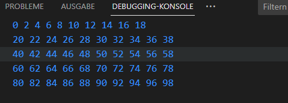

# Vielfaches einer Zahl

Es soll das Vielfache einer eingegebenen Zahl ausgegeben werden. Außerdem soll die obere Zahlengrenze (bis wohin soll überprüft werden, ob es sich um ein Vielfaches handelt?) eingegeben werden können. Anschließend soll jede Zahl bis jener Grenze überprüft werden, ob sie ein Vielfaches der eingegebenen Zahl ist. Falls der Begriff [Vielfaches](https://de.bettermarks.com/mathe/teilermengen-und-vielfachenmengen/#:~:text=Vielfache%3AEine%20Zahl%20x%20ist,Vielfaches%20ist%20von%20x%20ist.) noch nicht klar ist, schaue diesen nach.
Außerdem sollen in der Konsole nur zehn Vielfache pro Zeile ausgegeben werden wie im Bild unten.
Beispiel Vielfache von 2, Obergrenze 100:

Ein Tipps zur Umsetzung: 
* Zwei Eingaben
* Eine Hilfsvariable, die hochgezählt wird bei erfolgreicher Bedingung
* Eine leeres *array* um die Zahlen zu speichern
* Eine Schleife, die bis zur Obergrenze läuft
* Eine Bedingung, die die Teilbarkeit checkt, ansonsten soll die Schleife normal weiterlaufen
* Eine Bedingung die checkt, ob die Hilfsvariable die maximale Anzahl von Nummern einer Zeile erreicht hat
* das Array kann mit dem *spread-operator* `console.log(..array)`ausgegeben werden
* Hilfsvariable muss wieder auf 0 gesetzt werden, nachdem die Zeile geschrieben wurde. Ebenfalls muss das *array* entsprechend geleert werden

Es gibt mehrere Möglichkeit das Problem zu lösen, ich gebe nur eine Anleitung an, damit möglichst viele *syntaktische* Eigenheiten von *JavaScript* verwendet werden. Eine andere Umsetzung ist natürlich möglich.
